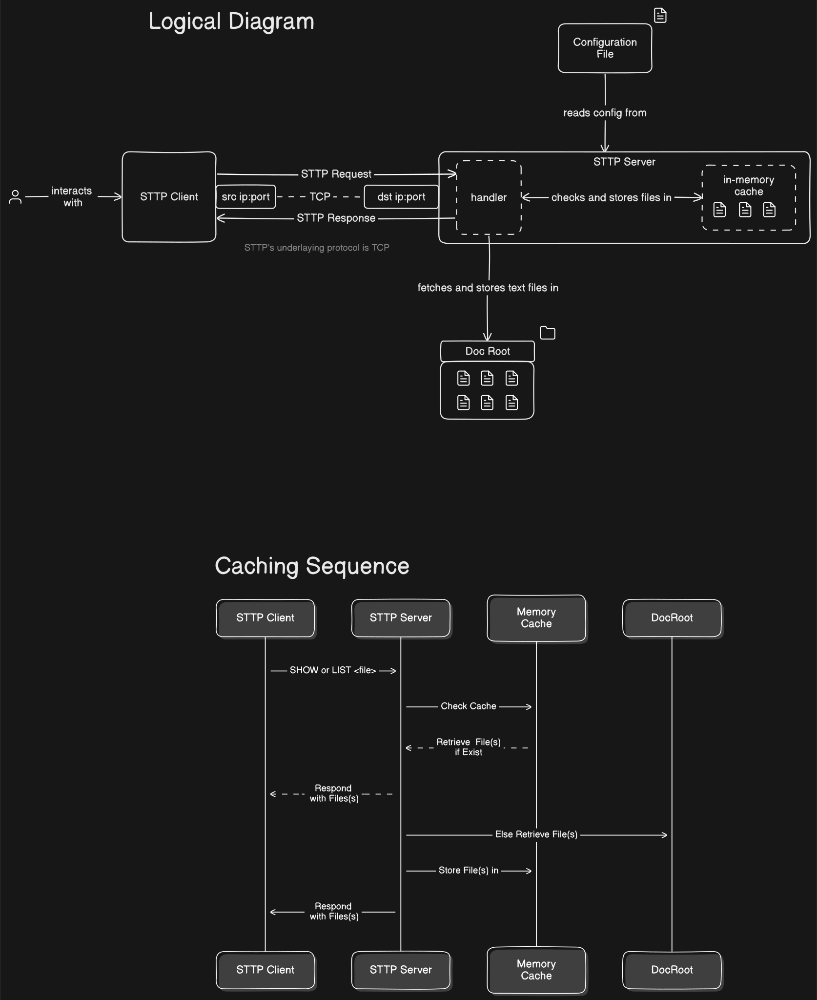

# STTP Protocol Specification (Short Text Transfer Protocol)

## 1. Introduction
STTP (Short Text Transfer Protocol) is a lightweight protocol designed for simple file management over TCP. The protocol allows clients to create, retrieve, update, delete, and list files containing short text snippets, each up to 160 characters long.

## 2. STTP Request Format
An STTP request follows this format:

```
<action> <path/filename> (<contents> optional)\n
```

### 2.1 Actions
- `CREATE`: Create a new file with the specified content.
- `SHOW`: Retrieve the content of a specified file.
- `LIST`: List all files within a specified directory.
- `DELETE`: Delete the specified file.
- `UPDATE`: Update the content of a specified file.

### 2.2 Path/Filename
- `path/filename`: Specifies the directory path and filename. Filenames must not exceed 32 characters.

### 2.3 Contents
- `<contents>`: Optional content for the file, required for `CREATE` and `UPDATE`. Content must not exceed 160 characters.

### 2.4 Example Requests
- **CREATE**:
  ```
  CREATE /notes/reminder.txt "Buy milk"\n
  ```
- **SHOW**:
  ```
  SHOW /notes/reminder.txt\n
  ```
- **LIST**:
  ```
  LIST /notes/\n
  ```
- **DELETE**:
  ```
  DELETE /notes/reminder.txt\n
  ```
- **UPDATE**:
  ```
  UPDATE /notes/reminder.txt "Buy milk and bread"\n
  ```

## 3. STTP Response Format
An STTP response follows this format:

```
<status> <path/filename> <message>\n
<contents (optional)>\n
```

### 3.1 Status Codes
- `100 CREATED`: File was successfully created.
- `200 OK`: Request was successfully processed (e.g., file retrieved, list generated, file updated).
- `300 CLIENT ERROR`: Client made a request with an invalid format or other client-side issue.
- `310 FILENAME TOO LONG`: The provided filename exceeds 32 characters.
- `400 NOT FOUND`: The specified file or directory was not found.
- `410 PATH NOT FOUND`: The requested path does not exist.
- `500 SERVER ERROR`: An internal server error occurred.
- `510 CANNOT CREATE PATH`: The server could not create the requested path.
- `600 DELETED`: The specified file was successfully deleted.

### 3.2 Response Specification
- **100 CREATED**:
  - **Use When**: The server successfully creates a new file.
  - **Format**: 
    ```
    100 <path/filename> CREATED\n
    ```
  - **Example**:
    ```
    100 /notes/reminder.txt CREATED\n
    ```

- **200 OK**:
  - **Use When**: 
    - The server successfully retrieves file content (`SHOW`).
    - The server successfully lists directory contents (`LIST`).
    - The server successfully updates a file (`UPDATE`).
  - **Format**: 
    ```
    200 <path/filename> OK\n
    <contents>\n
    ```
  - **Example for SHOW**:
    ```
    200 /notes/reminder.txt OK\n
    Buy milk\n
    ```
  - **Example for LIST**:
    ```
    200 /notes/ OK\n
    reminder.txt, meeting.txt\n
    ```

- **300 CLIENT ERROR**:
  - **Use When**: The server encounters a general client-side error (e.g., invalid request format).
  - **Format**: 
    ```
    300 <path/filename> CLIENT ERROR <message>\n
    ```
  - **Example**:
    ```
    300 /notes/reminder.txt CLIENT ERROR "Invalid request format"\n
    ```

- **310 FILENAME TOO LONG**:
  - **Use When**: The client provides a filename that exceeds 32 characters.
  - **Format**: 
    ```
    310 <path/filename> FILENAME TOO LONG\n
    ```
  - **Example**:
    ```
    310 /notes/verylongfilenameindeed.txt FILENAME TOO LONG\n
    ```

- **400 NOT FOUND**:
  - **Use When**: The requested file or directory does not exist.
  - **Format**: 
    ```
    400 <path/filename> NOT FOUND\n
    ```
  - **Example**:
    ```
    400 /notes/reminder.txt NOT FOUND\n
    ```

- **410 PATH NOT FOUND**:
  - **Use When**: The requested path does not exist.
  - **Format**: 
    ```
    410 <path> PATH NOT FOUND\n
    ```
  - **Example**:
    ```
    410 /invalidpath/ PATH NOT FOUND\n
    ```

- **500 SERVER ERROR**:
  - **Use When**: The server encounters an internal error while processing the request.
  - **Format**: 
    ```
    500 <path/filename> SERVER ERROR <message>\n
    ```
  - **Example**:
    ```
    500 /notes/reminder.txt SERVER ERROR "Unable to write to disk"\n
    ```

- **510 CANNOT CREATE PATH**:
  - **Use When**: The server is unable to create the requested path when attempting to create or update a file.
  - **Format**: 
    ```
    510 <path> CANNOT CREATE PATH\n
    ```
  - **Example**:
    ```
    510 /unwritablepath/ CANNOT CREATE PATH\n
    ```

- **600 DELETED**:
  - **Use When**: The server successfully deletes the specified file.
  - **Format**: 
    ```
    600 <path/filename> DELETED\n
    ```
  - **Example**:
    ```
    600 /notes/reminder.txt DELETED\n
    ```

## 4. Summary of Rules
1. **Filename Length**: Filenames must not exceed 32 characters. If they do, the server should return a `310 FILENAME TOO LONG` response.
2. **Content Length**: Content in `CREATE` and `UPDATE` requests must not exceed 160 characters.
3. **Path Handling**:
   - If the requested path does not exist, the server should return a `410 PATH NOT FOUND` response.
   - If the server is unable to create the necessary path, it should return a `510 CANNOT CREATE PATH` response.

---

# STTP Server Configuration Options
```yaml
# STTP Server Configuration

# The address the STTP server should listen on.
listen_address: "0.0.0.0"

# The port the STTP server should listen on.
port: 8080

# The root directory where the STTP server will store and manage files.
docroot: "/var/sttp/files"


# Cache Configuration
cache:
  # Enable or disable caching (true or false).
  enabled: true

  # The maximum number of files to cache in memory.
  max_files: 100

  # The maximum size of the cache in bytes.
  max_size: 10485760 # 10 MB

  # The duration for which files should be cached, in seconds.
  expiration: 300 # 5 minutes

```

## Implementing Caching
When caching files the keys to uniquely identify a cached item should be the entire requested file path `/some/path/snippet.txt` NOT just `snippet.txt`

## Testing Caching
To Test Caching functionality, you can use the `runPerformanceTest.sh` script. Modify the variables within it as needed.

```bash
chmod +x runPerformanceTest.sh
./runPerformanceTest.sh -h
```


# Interaction with an STTP Server using Netcat
Here are some example commands using `netcat` (`nc`) to interact with the STTP server. These examples assume the STTP server is running on `<ip_address>` at port `8080`.

### 1. **CREATE a File**
Create a file named `reminder.txt` with the content "Buy milk":

```bash
echo -e "CREATE /notes/reminder.txt Buy milk\n" | nc <ip_address> 8080
```

### 2. **SHOW the Content of a File**
Retrieve the content of the file `reminder.txt`:

```bash
echo -e "SHOW /notes/reminder.txt\n" | nc <ip_address> 8080
```

### 3. **LIST Files in a Directory**
List all files in the `/notes` directory:

```bash
echo -e "LIST /notes/\n" | nc <ip_address> 8080
```

### 4. **UPDATE a File**
Update the content of the file `reminder.txt` to "Buy milk and bread":

```bash
echo -e "UPDATE /notes/reminder.txt Buy milk and bread\n" | nc <ip_address> 8080
```

### 5. **DELETE a File**
Delete the file `reminder.txt`:

```bash
echo -e "DELETE /notes/reminder.txt\n" | nc <ip_address> 8080
```

### 6. **HANDLE FILENAME TOO LONG**
Attempt to create a file with a filename that exceeds 32 characters:

```bash
echo -e "CREATE /notes/this_is_a_very_long_filename_that_exceeds_32_characters.txt Short text\n" | nc <ip_address> 8080
```

### 7. **HANDLE NON-EXISTENT PATH**
Attempt to show a file in a non-existent path:

```bash
echo -e "SHOW /nonexistentpath/file.txt\n" | nc <ip_address> 8080
```

### Notes:
- **`echo -e`**: The `-e` flag in `echo` enables interpretation of backslash escapes, which is used to ensure the newline `\n` is correctly processed.
- **`nc <ip_address> 8080`**: `nc` (or `netcat`) connects to the STTP server running on `<ip_address>` at port `8080`.
  
These commands demonstrate how you can use `netcat` to send various requests to the STTP server and receive responses according to the protocol you've defined.

# STTP Example Client CLI 

Here’s a proposed CLI design for an STTP client, with flags and options that can be implemented using Go's `flag` package.

### STTP Client CLI

#### Usage
```bash
sttp-client [OPTIONS] <action> <path/filename> [content]
```

#### Actions
- `create`: Creates a file with the specified content.
- `show`: Retrieves the content of the specified file.
- `list`: Lists files in the specified directory.
- `delete`: Deletes the specified file.
- `update`: Updates the specified file with new content.

#### Global Flags and Options
- `-a, --address string`: The server address to connect to. (default: `localhost`)
- `-p, --port int`: The server port to connect to. (default: `8080`)
- `-h, --help`: Displays help information.
- `-v, --verbose`: Enables verbose output for debugging.

#### Examples

1. **CREATE a file**:
   ```bash
   sttp-client create /notes/reminder.txt "Buy milk" -a 127.0.0.1 -p 8080
   ```

2. **SHOW the content of a file**:
   ```bash
   sttp-client show /notes/reminder.txt -a localhost -p 8080
   ```

3. **LIST files in a directory**:
   ```bash
   sttp-client list /notes/ -a localhost -p 8080
   ```

4. **DELETE a file**:
   ```bash
   sttp-client delete /notes/reminder.txt -a localhost -p 8080
   ```

5. **UPDATE a file**:
   ```bash
   sttp-client update /notes/reminder.txt "Buy milk and bread" -a 127.0.0.1 -p 8080
   ```


### Explanation:
- **Global Flags**:
  - `-a, --address`: Specifies the server address. Defaults to `localhost`.
  - `-p, --port`: Specifies the server port. Defaults to `8080`.
  - `-v, --verbose`: Enables verbose output for debugging.
  - `-h, --help`: Shows usage information.
  
- **Actions**: Correspond to the STTP actions: `create`, `show`, `list`, `delete`, and `update`.
- **Path/Filename**: The required path or filename for the action.
- **Content**: Optional, used for `create` and `update` actions.

This design allows the STTP client to be easily extended or modified, and it’s straightforward to implement using Go's `flag` package.


# Diagram

